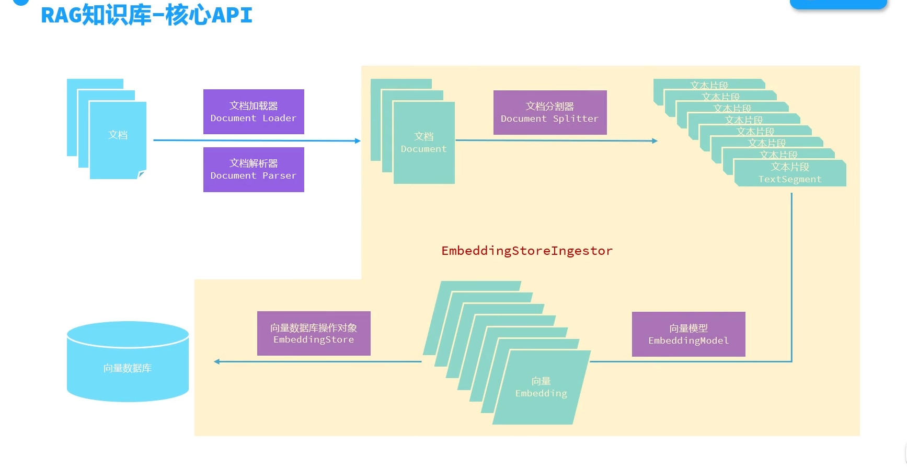
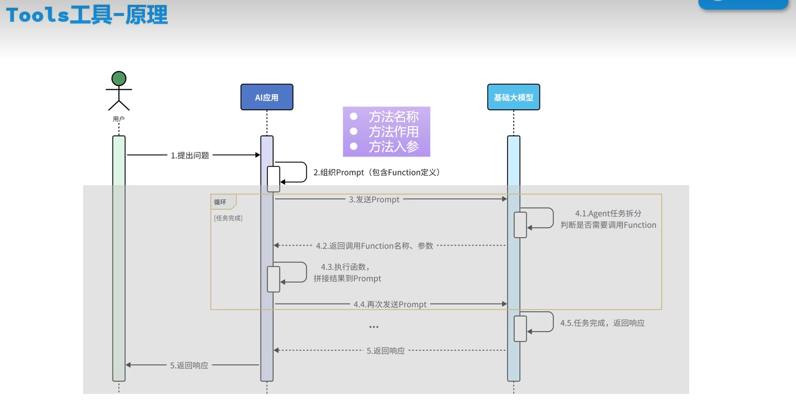

# 智能咨询Agent

## 一.项目介绍

## 二.技术选型

Spring Boot 2.x Spring MVC 数据存储层：

MySQL：存储数据 MyBatis Plus：数据访问框架 Redis 相关：

spring-data-redis：操作 Redis Lettuce：操作 Redis 的高级客户端 Apache Commons Pool：用于实现 Redis 连接池 Redisson：基于 Redis 的分布式数据网格 工具库：

LandChain4j： 基于AI的智能问答工具包

## 三.功能模块

### （1）AIService

AIService自动创建AI服务，包括问答、聊天、情感分析等功能。

### （2）流式调用


### （3）会话记忆


### （4）RAG
RAG核心API：



1.文档加载器
* FileSystemDocumentLoader：从本地文件系统加载文档
* ClassPathDocumentLoader：从classpath加载文档
* UrlDocumentLoader：从URL加载文档

2.文档解析器
* TextDocumentParser：解析文档为TextDocument
* ApachePdfBoxDocumentParser：Apache PDFBox 解析器
* ApachePoiDocumentParser：解析微软的office文件，例如DOC、PPT、XLS等
* ApacheTikaDocumentParser：默认解析器，几乎可以解析所有格式文件

3.文档分割器
* DocumentParagraphSplitter：分割文档为段落
* DocumentLineSplitter：分割行为文本
* DocumentSentenceSplitter：分割文档为句子
* DocumentCharacterSplitter：分割文档为字符
* DocumentWordSplitter：分割文档为词语
* DocumentByRegexSplitter：通过正则表达式分割文档
* DocumentSplitter：默认递归分割器，优先段落分割，然后行分割，最后字符分割，最后词语分割，最后句子分割，最后段落分割，最后行分割，最后字符分割，最后词语分割，最后句子分割，最后段落分割，最后行分割，最后字符分割，最后词语分割，最后句子分割，最后段落分割，最后行分割，最后

4.向量模型

EmbeddingModel：文本嵌入模型，用于把文档分割后的片段向量化或者查询时把用户输入的内容向量化

### （5）Tools工具



ReservationTool和ConsultantService核心代码如下：


    @Tool("预约志愿填报服务")
    public void  addReservation(
            @P("考生姓名") String name,
            @P("考生性别") String gender,
            @P("考生手机号") String phone,
            @P("预约沟通时间,格式为: yyyy-MM-dd'T'HH:mm") String communicationTime,
            @P("考生所在省份") String province,
            @P("考生预估分数") Integer estimatedScore
    ){
        Reservation reservation = new Reservation(null,name,gender,phone, LocalDateTime.parse(communicationTime),province,estimatedScore);
        reservationService.insert(reservation);
    }
    //2.工具方法: 查询预约信息
    @Tool("根据考生手机号查询预约单")
    public Reservation findReservation(@P("考生手机号") String phone){
        return reservationService.findByPhone(phone);
    }

    @AiService(
            wiringMode = AiServiceWiringMode.EXPLICIT,//手动装配
            chatModel = "openAiChatModel",//指定模型
            streamingChatModel = "openAiStreamingChatModel", //指定流式模型
            //chatMemory = "chatMemory",//配置会话记忆对象
            chatMemoryProvider = "chatMemoryProvider",//配置会话记忆提供者对象
            contentRetriever = "contentRetriever",//配置向量数据库检索对象
            tools = "reservationTool"   //配置工具集对象
        )


## 四.配置文件修改

 ```yml
    langchain4j:
    open-ai:
      chat-model:  #非流式调用，默认使用chat-model
        base-url: https://dashscope.aliyuncs.com/compatible-mode/v1
        api-key: ${API-KEY}
        model-name: qwen-plus
        log-requests: true
        log-responses: true
      streaming-chat-model: #流式调用，默认使用chat-model
        base-url: https://dashscope.aliyuncs.com/compatible-mode/v1
        api-key: ${API-KEY}
        model-name: qwen-plus
        log-requests: true
        log-responses: true
      embedding-model:   #文本嵌入模型，默认使用embedding-model
        base-url: https://dashscope.aliyuncs.com/compatible-mode/v1
        api-key: ${API-KEY}
        model-name: text-embedding-v3
        log-requests: true
        log-responses: true
        max-segments-per-batch: 10

    community:
      redis:
        host: 192.168.100.128 #`redis`地址
        port: 6379
    logging:
      level:
        dev.langchain4j: debug

    spring:
      data:
        redis:
          host: 192.168.100.128  #redis地址
          port: 6379
    
      datasource: #mysql配置
        driver-class-name: com.mysql.cj.jdbc.Driver
        url: jdbc:mysql://localhost:3306/volunteer?serverTimezone=Asia/Shanghai&useSSL=false&allowPublicKeyRetrieval=true
        username: root   #数据库用户名
        password: 123   #数据库密码
    mybatis:
      configuration:
        map-underscore-to-camel-case: true
   ```
## 五.项目演示

